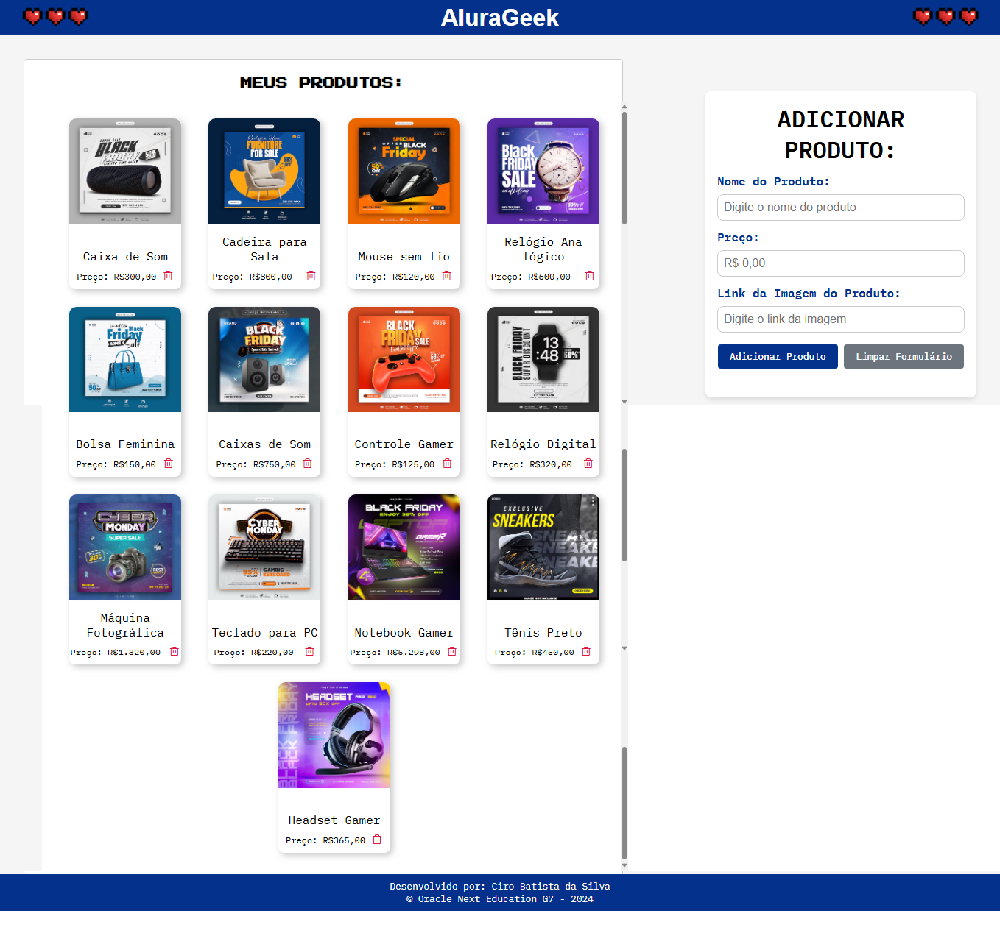
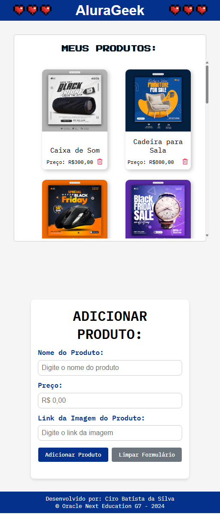
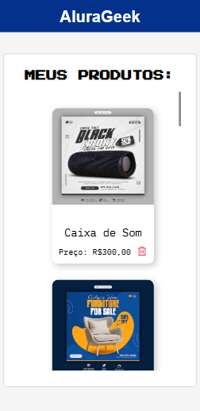
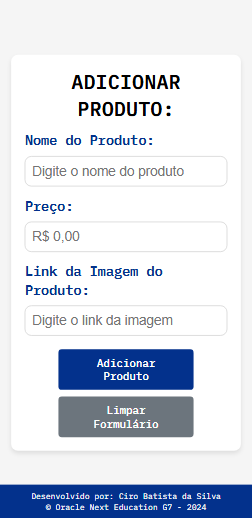

<h1 align="center"> Alura Geek </h1>

#### ⚙️ Desenvolvimento de uma aplicação para listar, cadastrar e deletar produtos. Construída durante o <em>Oracle Next Education-T7</em> no desafio `AluraGeek`. ⚙️

 

## Visualização do Projeto

| Desktop                                                                                       |
| --------------------------------------------------------------------------------------------- |
|                                               |

| Tablet                                 | Mobile                                                 |
| -------------------------------------- | ------------------------------------------------------ |
|  |     |

 

## 🛠 Tecnologias

Esse projeto foi desenvolvido com as seguintes tecnologias:

- **[HTML](https://developer.mozilla.org/pt-BR/docs/Web/HTML)**
- **[CSS](https://developer.mozilla.org/pt-BR/docs/Web/CSS/CSS_flexible_box_layout/Basic_concepts_of_flexbox)**
- **[Javascript](https://developer.mozilla.org/pt-BR/docs/Web/JavaScript)**
- **[NodeJS](https://nodejs.org/en)**
- **[NPM](https://www.npmjs.com/)**
- **[jason-server](https://www.npmjs.com/package/json-server)**
- **[freepik](https://br.freepik.com/search?file_type=jpg&format=search&last_filter=page&last_value=2&orientation=square&page=2&query=Produtos&selection=1#uuid=8653c9cb-d531-4f51-b602-9b227b959bb4)** Site para adicionar os links das imagens.

 

## 📝 License

  

Esse projeto está sob a licença MIT.

 

### 👨‍💻 Autor

 
 <em>Ciro Batista da Silva<em>
 
  

 
👋🏽 Entre em contato!

 

